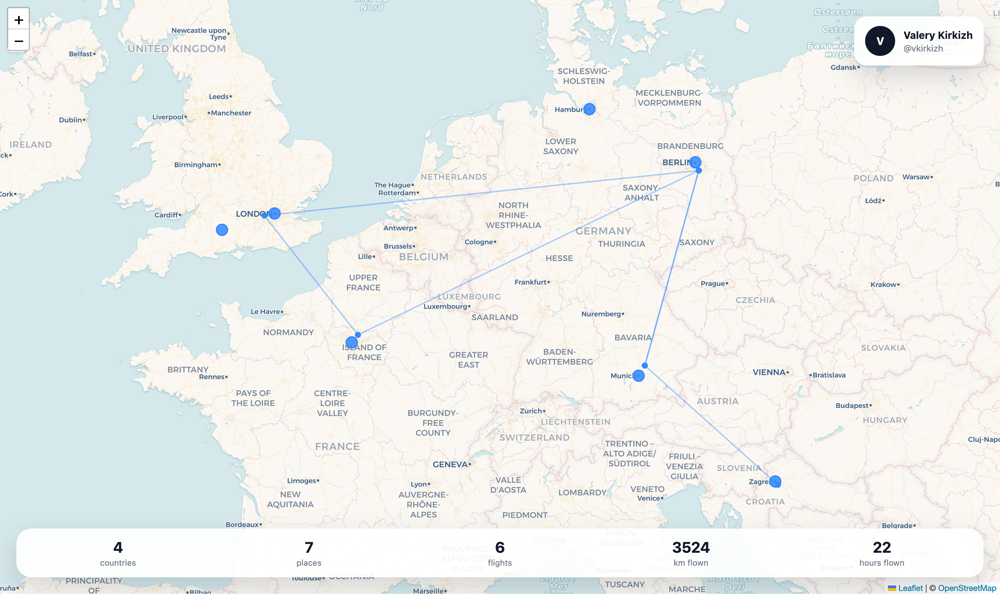

# Travel Map

A personal travel map for sharing visited places, flights and travel statistics.

## Stack

- Go
- PostgreSQL
- React
- TypeScript
- Leaflet
- Docker Compose

## Features

Current MVP:
- Public user travel map
- Visited places on OpenStreetMap
- Flight lines prototype
- Travel statistics
- Cookie-based authentication
- Private dashboard
- Places CRUD
- Nominatim geocoding with PostgreSQL cache

## Local development

Start database:
```bash
make dev-env
```

Run migrations:
```bash
make migrate-up
```

Seed demo data:
```bash
make seed-dev
```

Run backend:
```bash
make backend-run
```

Run frontend:
```bash
make frontend-run
```

Open:
```text
http://localhost:5173/
http://localhost:5173/vkirkizh/
```

Test user:
```text
Login: valery@kirkizh.com
Password: 123456
```

Health checks:
```bash
curl http://localhost:8080/healthz
curl http://localhost:8080/readyz
```

Development checks:
```bash
make backend-lint
make backend-test
```

## Geocoding

Travel Map uses Nominatim for geocoding during MVP development.
The backend caches geocoding results in PostgreSQL to avoid repeated external API calls for the same normalized query.

Relevant tables:
- `geocoding_cache`
- `countries`
- `places`

## Reference data

Travel Map uses OurAirports CSV datasets for countries and airports.
Download these files into the local `data` directory:
```text
data/countries.csv
data/airports.csv
```

Import reference data:
```bash
make import-countries
make import-airports
```

## Screenshots

### Public travel map



---

Author: Valery Kirkizh (valery@kirkizh.com)
