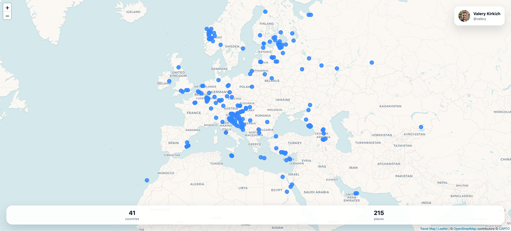

# Travel Map

A personal travel map for visualizing visited places.

**Live demo:** https://map.kirkizh.com/valery/



## Features

- Public travel maps with visited places and statistics
- Invite-based user registration and cookie-based authentication
- Private dashboard and profile settings
- Places management with Nominatim geocoding
- PostgreSQL-backed geocoding cache
- Automatic country detection from geocoding results
- Gravatar-based profile avatars

## Architecture

Travel Map is a small full-stack web application with a Go backend, React frontend and PostgreSQL database.

The backend is structured as a modular monolith with explicit domain boundaries.
It exposes an HTTP API for authentication, profile management, places and public maps.
External geocoding is handled through Nominatim and cached locally to reduce repeated requests.

The production deployment uses Docker Compose to run PostgreSQL, the Go backend and a frontend container.
The frontend container uses Caddy to serve the built application over HTTP, with a fallback to `index.html` for client-side routes.
A separately managed reverse proxy handles public HTTPS and routes requests to the backend and frontend through the external Docker network `edge`.
The edge proxy is managed separately from this application.

## Stack

**Backend:** Go, PostgreSQL\
**Frontend:** React, TypeScript, Leaflet\
**Infrastructure:** Docker, Docker Compose, Caddy\
**External services:** Nominatim, CARTO, Gravatar

## Local development

### Requirements

- Go 1.26 or newer
- Node.js 26 and npm
- Docker with Docker Compose
- Make
- The `migrate` CLI from [golang-migrate](https://github.com/golang-migrate/migrate)
- The PostgreSQL `psql` client for loading development seed data
- [golangci-lint](https://golangci-lint.run/) for backend linting

Run the following commands from the repository root.

### Environment and dependencies

Create local environment files if they do not already exist:

```bash
test -f backend/.env || cp backend/.env.example backend/.env
test -f frontend/.env || cp frontend/.env.example frontend/.env
```

Set `VITE_CARTO_API_KEY` in `frontend/.env` to your CARTO API key.
Keep `VITE_API_BASE_URL=http://localhost:8080` for local development.
The backend environment example contains the connection settings for the local PostgreSQL container.

Install frontend dependencies:

```bash
npm --prefix frontend ci
```

### Database

Start PostgreSQL and wait for it to become healthy:

```bash
make dev-env
```

Apply migrations:

```bash
make migrate-up
```

Load the demo user and places into the local development database:

```bash
make seed-dev
```

The seed is for local development only. It replaces the demo user's places.

### Run the application

Run the backend in one terminal:

```bash
make backend-run
```

Run the frontend in another terminal:

```bash
make frontend-run
```

The application will be available at:

```text
http://localhost:5173/
http://localhost:5173/valery/
http://localhost:5173/app/
```

Local demo credentials:

```text
Login: valery@kirkizh.com
Password: 123456
```

### Development checks

Run backend tests and linting, frontend linting and the frontend build:

```bash
make check
```

## Author

Valery Kirkizh

<valery@kirkizh.com>
